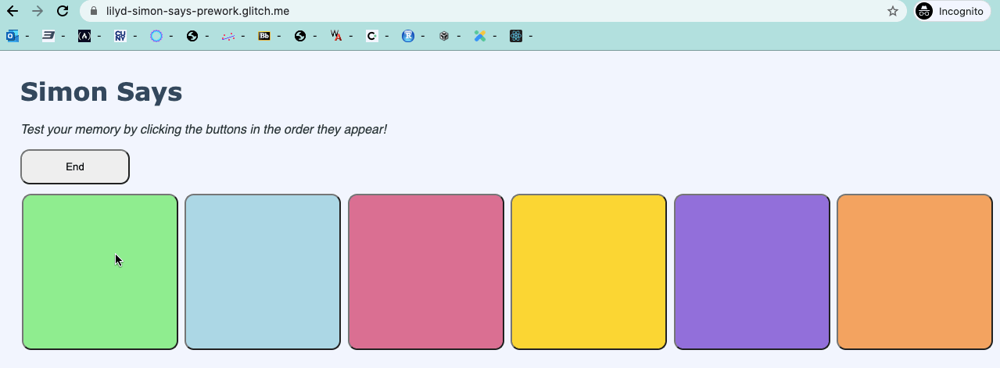

# Pre-work - *Simon Says*

**Simon Says** is a Light & Sound Memory game to apply for CodePath's SITE Program. 

Submitted by: **Lily D**

Time spent: **6** hours spent in total

## Required Functionality

The following **required** functionality is complete:

* [x] Game interface has a heading (h1 tab), a line of body text (p tag), and four buttons that match the demo app
* [x] "Start" button toggles between "Start" and "Stop" when clicked. 
* [x] Game buttons each play a sound when clicked. 
* [x] Computer plays back sequence of clues including sound and visual cue for each button
* [x] Play progresses to the next turn (the user gets the next step in the pattern) after a correct guess. 
* [x] User wins the game after guessing a complete pattern

The following **optional** features are implemented:

* [x] Any HTML page elements (including game buttons) has been styled differently than in the tutorial
* [x] Buttons use a pitch (frequency) other than the ones in the tutorial
* [x] More than 4 functional game buttons
* [ ] Playback speeds up on each turn
* [ ] Computer picks a different pattern each time the game is played
* [ ] Player only loses after 3 mistakes (instead of on the first mistake)
* [ ] Game button appearance change goes beyond color (e.g. add an image)
* [ ] Game button sound is more complex than a single tone (e.g. an audio file, a chord, a sequence of multiple tones)
* [ ] User has a limited amount of time to enter their guess on each turn

## Video Walkthrough

Here's a walkthrough of implemented user stories:

GIF created with [LiceCap](http://www.cockos.com/licecap/).

## Reflection Questions
1. **If you used any outside resources to help complete your submission (websites, books, people, etc) list them here.**

w3schools (color selection)

2. **What was a challenge you encountered in creating this submission (be specific)? How did you overcome it? (recommended 200 - 400 words)**

One challenge I faced when building this game was the guess() function. The flow chart that CodePath had provided helped me determine the major routes the game could go. However, I struggled to develop all the necessary if-conditions because there were many variables to consider, like the user's button choice and the assigned button in the pattern. I drafted my own function and compared it to the version CodePath had provided- theirs turned out to be drastically different, so I took some time to read through their correct code. I realized that I could view the flow chart from the bottom-up so the code could meet all the existing conditions for a game win or loss. To better improve my understanding of functions with if-statements, I will need to independently work on example problems with their own flow charts and practice my implementation of them with code. Other than the guess() function, some smaller challenges I faced during the creation of this game were the stylistic choices and sound timing. Exploring different sizes and colors was fun, and I was able to learn how to maneuver the metrics and customize visual features (button sizes, text fonts, background colors) to my liking.

3. **What questions about web development do you have after completing your submission? (recommended 100 - 300 words)**

I am curious about the principles and strategies used in CSS. Formatting visual aspects of websites requires knowledge of various methods and means of manipulation. What would be some good ways to practice these more creative skills? Also, since there is no right or wrong way to approach web design, how could I tell if my website is aesthetically pleasing or accessible to all? In addition, I am curious about the nuances of Javascript. For example, I would like to know more about the different built-in functionalities that Javascript has, that other languages do not (like the alert and .findDocumentById features).

4. **If you had a few more hours to work on this project, what would you spend them doing (for example: refactoring certain functions, adding additional features, etc). Be specific. (recommended 100 - 300 words)**

If I had a few more hours to work on this project, I would work on implementing uniquely generated patterns every game. CodePath had suggested to view Javascript documentation on the Math.random() function, but I couldn't find the right approach for it, and the changes I made kept disrupting the original code. I will make sure to read more about the function and apply logic to the pattern sequence. Besides the unique patterns feature, I would also work on a congratulatory pop-up image when the player wins the game. This would require animation in the CSS file, and building one or more functions in the Javascript file.

## License

    Copyright [2021] [Lily D]

    Licensed under the Apache License, Version 2.0 (the "License");
    you may not use this file except in compliance with the License.
    You may obtain a copy of the License at

        http://www.apache.org/licenses/LICENSE-2.0

    Unless required by applicable law or agreed to in writing, software
    distributed under the License is distributed on an "AS IS" BASIS,
    WITHOUT WARRANTIES OR CONDITIONS OF ANY KIND, either express or implied.
    See the License for the specific language governing permissions and
    limitations under the License.
